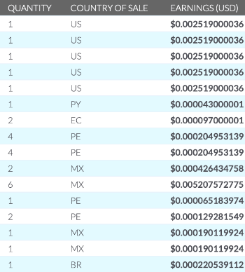
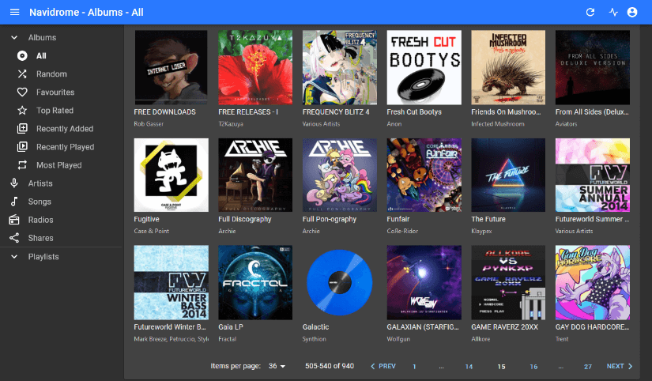
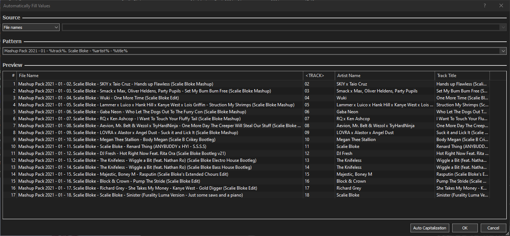
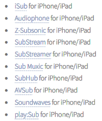
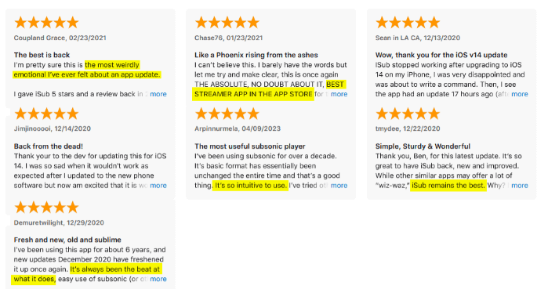
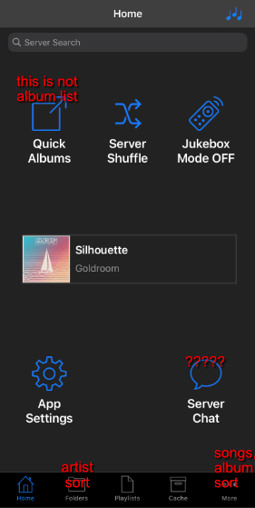
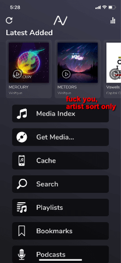
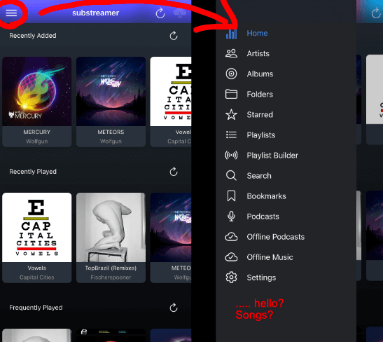
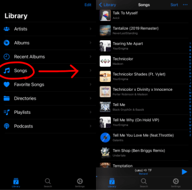

# The Quest for a Streaming Music Player That Doesn't Suck

I care a lot about music.

It is an integral part of who I am as a person, something I invest a lot of time and care into, and the primary source of so much inspiration and so much meaning in my life. As a result of this, I am very opinionated about the way I listen to my music, and what sorts of features are important to me. I feel like my standards aren't actually that high, but I have specific requirements that popular music services deliberately do not support.

I am a DJ. If I want to use music in a DJ set, I need to have a DRM-free flat file. Music streaming services are useful for discovering new things, but if I want to mix a song in a DJ performance, I need to have a file. Modern music platforms are going out of their way to try and destroy the concept of a "file", which is no bueno.

Back in high school, I did things the caveman way - I manually copied files onto my Android's microSD card from my computer, maintaining separate copies of my library per device, and played them with [Poweramp](https://play.google.com/store/apps/details?id=com.maxmpz.audioplayer&hl=en_US&gl=US). Poweramp is a wonderful, beautiful, amazing media player, and you should absolutely go give them all of your money right now, but there's one issue - **I switched to iPhone**.

*`spooky_organ.wav`*

There are a variety of reasons I did that and I won't get into them now, but the consequence of switching to iPhone was that I needed to find a new solution for my music. This also came with the additional restriction of no longer having a microSD slot, so the bigger my library gets, the harder it becomes to fit on an iPhone.

Which means, ideally, the music shouldn't have to live on the phone at all. Hey, wouldn't it be nice if my phone and my computer could stay in sync so I didn't have to manually copy things back and forth?

**Ding dong!** Here comes Apple with what seems like the perfect solution. Their Apple Music service allows you to upload your own music, and stream it from the cloud. You can easily cache specific songs/albums/playlists for offline listening, and your manually uploaded music coexists seamlessly with songs from the Apple Music service. Even more cool, because my DJ software integrates with Apple Music, **any playlists I create on my phone will automatically sync with my DJ software on my laptop**. That is an extremely useful and good feature.

On top of all of that, Apple's Music app is simply the best-engineered interface I have ever used for music listening. Poweramp is great in terms of features, but not even that masterpiece can compete with Apple's blissfully smooth interface. Apple's UI is laid out sensibly and intuitively, it will always be able to tell the exact gesture you were intending to perform, it never lags, it never crashes, and it looks gorgeous. All of my devices seamlessly integrate with each other, I can just run my entire library through Apple and have all of my devices automagically synchronized.

Seems perfect, right?

Of fucking course not, this is Apple.

# God Fucking Damn It Apple

You may notice, if you try to upload a song that *previously* existed on the Apple Music service, but has since been de-listed from the service, you are outright prevented from listening to it **even though you uploaded the file yourself**. Daddy Apple says you aren't allowed to hear that song. Even my DJ software can't use it if Apple blacklists it!

Even *more* unforgivable is what happens to the file format. I download my music in lossless FLAC whenever possible, and that should be fine because Apple Music does support lossless! You can upload and stream things in ALAC, helpfully accompanied by a "Lossless" icon on the player screen to indicate you are receiving high quality audio.

Sounds great and all, except for the part where it will randomly decide to irreversibly downgrade your shit to 256kbps AAC whenever it feels like. Things uploaded as ALAC will get downgraded to AAC, but only sometimes, not every time. My initial theory was that this happened whenever it matches an uploaded song with a song that exists on Apple Music, but no, that would make too much sense. It's not filesize related either, becuase hour-long DJ sets maintained their lossless quality but individual songs did not.

I cannot figure out why that happens, it's just completely fucking arbitrary. There is no discernible way to ensure that a song remains in the same format you uploaded it in. You are quite literally flipping a coin for whether your lossless file stays lossless or not. That is fucking unacceptable. I am **so angry** about this. Why does that even happen?!

So basically, if you want to use Apple, you do not own or control your own files. You are not given ultimate authority over the data that you provide, and Apple will blacklist things and downgrade their quality without giving you a choice.

So... god damn it.

Apple was so close to being perfect, in many ways they are still better than anyone else's offerings, but they just had to shoot themselves in the foot right at the finish line. They practically already won, but they just had to fuck it up. That's an instant deal-breaker, and now I have to find something else. Thanks.

So what now? There are so many features that Apple Music spoiled me with, things Poweramp couldn't do. I don't have the space to keep all the music locally on the phone, so I have to stream it *somehow*. How, exactly, can I fulfill the unique workflow that Apple allowed me to have, but avoiding the stupid fucking problems?

# The Commercial Alternatives

When it comes to apps and interfaces, and especially interoperability with the other things I use, all of the other commercial music streaming services suck and I hate them all.

Very few options allow you to upload your own music and merge them with the streaming service, and none of the ones that do are anywhere near as versatile or user-friendly as Apple's. That convenience of being able to listen to anything on the store with the same searchbox as my personal library is not worth the cost of not truly owning or controlling my own god damn files, so I'm just going to have to give up on that luxury.

This is a slightly unrelated side rant, but these services are also viciously exploitative of the artists - you really are not supporting anyone by streaming their music on Spotify.

Here is what Spotify pays me.

If you listen to my song 4 times, I might get a whopping ***$0.0002***.

Wow, thanks. I'd rather you just pirate it. ([but you don't have to](https://deltaryz.com/))

There were already multiple practical reasons I need to have flat files, but also knowing this is how artists are treated, I'd still much rather purchase things directly and download them regardless. Musicians deserve better than what Spotify gives them, and cultivating your own local collection encourages a more intimate relationship with that music. (It'll probably be better quality too.)

There ARE some options which are specifically focused on the "upload your own music" part and not the "streaming service" part, such as [Vox](https://vox.rocks/loop-music-cloud-storage). The Vox player has a really nice interface and works well, but I'd rather not be beholden to another paid subscription service & their arbitrary limitations.

Based on my limited research, it looks to me like anything you upload to VOX Cloud is walled off on THEIR servers, and you don't really get direct filesystem access to the files outside of Vox's own player - that won't work for me. DJ software can't connect with that.

And that's the thing with all these commercial services - they're too much of a walled garden. You don't really have control over your data, and that is something I need to have. None of these services seem to believe in giving the user access to A FILE, instead they all have to run you through their proprietary ass infrastructure - even if it's sourcing the data from a file you uploaded.

You don't own anything. You can only access the data in specific ways they prepared for you. They can take it away from you.

# Self-Hosting

So rather than going through a commercial service, instead I look towards self-hosted solutions.

To do this, we will need both a server and a client. The server, a computer program, will be running on the NAS in my house - but this could feasibly be run on any computer with an active Internet connection and enough space for your music. The music will live on this machine.

My first candidates for the server were Plex and Jellyfin, which I've already used for video streaming, because they advertise music library features... but they're incredibly slow and bloated with unrelated features and not really primarily built for this purpose. Most of your effort spent using them is navigating around things you'd rather it not be doing, or waiting. Too unwieldy.

Further digging lead me to discover a thing called the [Subsonic API](http://www.subsonic.org/pages/index.jsp), which is actually implemented by a shitload of different projects. There's Subsonic itself, Ampache, Gonic, LMS, Navidrome, jpsonic, Beetstream, hypersonic, and... many more. Guess I need to pick one randomly and hope it's good.

I'm sure every person is going to have a different preference for which one of these best suits their individual needs. The exact way you organize, access, and expand your library will determine which of these options best fits you. For me personally, [Navidrome](https://www.navidrome.org/) turned out to be pretty cool.

It was the first one I tried, and I did not feel particularly compelled to try any different ones. Lucky draw on this one.

I like Navidrome because it does exactly what it needs to, it does that very well, and it does **absolutely nothing else**. You point it towards a folder, make sure the settings are tuned to read your library's metadata correctly, and then it just works. You may sometimes need to trigger a manual refresh to pick up on some metadata changes, but aside from that it's zero-maintenance.

The 'center of authority', the actual important data, is the raw music files and the metadata contained within them. Navidrome is simply the delivery agent that makes it accessible to our media player, it doesn't try to complicate anything with its own abstractions, it doesn't try to change the way I organize my own media. **It just reads files**. This is great, because I am able to use ANY software on the computer to access or modify these files without worrying about anything conflicting.

I can use [foobar2000](https://www.foobar2000.org/)'s delicious automated metadata editing, which is not something I could do with Apple!

I'm sorry to do this to you [Scalie Bloke](https://www.scaliebloke.com/), because your music is great, but oh my GOD this default metadata is horrendous. Please don't do this. Having the artist names all crammed in the `Title` field is a crime against nature and makes me cry. Shoutout to foobar2000 for making it easy to pull the *correct* metadata out of the filenames.

Anyway, I'm getting sidetracked. We haven't gotten to the fun part yet.

# The Client

Navidrome is not the thing you actually listen to the music with. It's more like the secretary, the delivery boy, the phone operator. You could use its own webUI if you wanted, but that's not a great experience on a phone (or in general). It is meant to integrate with a separate client application which is the part you actually *use*.

So what are our options on iOS?

Oh god that's a lot.

Oh god that list hasn't even been updated in a decade, there's more.

So... okay, let's just pick random ones until I find a good one. 

## [iSub](https://apps.apple.com/us/app/isub-music-streamer/id362920532)

The reviews paint a VERY positive impression.

These people are actually fucking insane. Nothing they say here reflects the experience I had with this app. My god, this interface is abysmal.

Everything in the app is placed in such a bizarre and out-of-the-way spot that takes way too many taps to get to. Obscure useless features like a CHATROOM are giant buttons on the first screen of the app, and basic necessities like *an alphabetical list of songs or albums* are **disabled completely by default**, still buried in the "More" screen after you enable it, and it *miserably* struggles to display a whopping 22 songs without tripping over itself.

There is a "Folders" page. It does not display the folders as they exist on the filesystem, this is actually where things are sorted by ARTIST NAME.

The whole app is slow, crash-prone, froze a lot, it constantly required me to manually trigger refreshes, and generally just makes it very difficult to access anything at all.

It fundamentally fails to be a functional music player, and its interface baffles me with how badly designed it is. This is not made for humans, this is practically satire. Worst of all, it doesn't even function properly.

These reviewers are on crack.

Needless to say, this isn't the one.

## [AVSub](https://apps.apple.com/us/app/avsub/id923424694?platform=iphone)

I decided, maybe a free app isn't going to cut it. Maybe I need to be willing to support the hard work a developer puts in. This one looks promising, the screenshots on the App Store look appealing and the feature list is robust.

One $4 purchase later, and...

I immediately hate it.

You have "Media Index", which then asks you to pick a letter of the alphabet, and then shows you each artist name that starts with that letter, and *then* finally a couple songs. You can configure it to skip the first screen and just put all of the artists in one big list, but artist-based navigation is apparently the only way this app allows you to browse your music.

There is no way to list songs OR albums AT ALL. Our only fucking option is artist sort, or the recently added stuff (~20 items) under "Get Media".

Not only this, but there are multiple additional features gated off behind more in-app purchases. In an app that already costs money. What the fuck.

Immediate refund.

## [Substreamer](https://apps.apple.com/lv/app/substreamer/id1012991665)

Third time's the charm, hopefully?

Of the three so far, this one actually looks like a proper UI engineer and/or graphic designer breathed in the general direction of this project. Somebody might actually be able to listen to music with this thing, what a shocker. The menu is laid out in a sensible fashion, elements are well-spaced and readable, scrolling is smooth and never drops frames. It loads my entire 2600 song library quickly.

"Folders" is redundant because it's just another artist sort, same as iSub's weird folder screen. (That's definitely not how my folders are structured, so I don't know what "Folders" is supposed to mean in the context of these apps).

Overall, this app is actually pretty good. Too bad it still doesn't give me an alphabetical list of songs. It does everything else I need, but not that.

So close, guys. So fucking close.

Next.

## [Amperfy](https://apps.apple.com/us/app/amperfy-music/id1530145038)

I swear to fuck. Fucking hell. How hard is it to...

**PRAISE THE FUCKING LORD**

*SALVATION IS HERE*

WE DID IT. WE WON. WE FOUND IT

🥳 🎉 👏 🔥 💥

God, I cannot express how relieved I am that someone understands how to make a decent fucking interface.

The $4 refund I got from AVSub has now been donated to this developer instead.