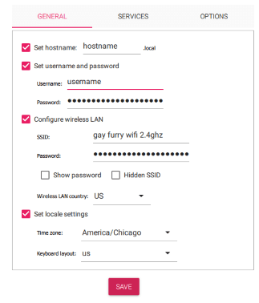
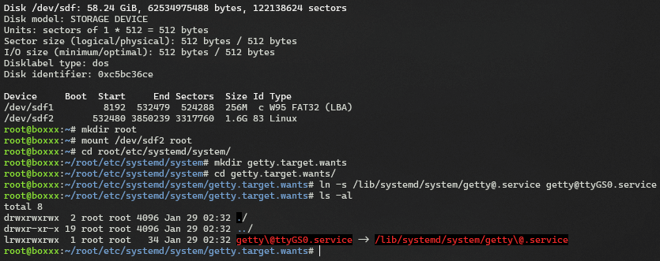

# The Best Raspberry Pi USB Serial Gadget Guide

Did you know that it's possible to plug a Raspberry Pi Zero (W) directly into your computer, and not only does this power the Pi, but you can also have it communicate with your computer this way?

There are many, many guides for this purpose. Because I have used them as reference, I will credit my sources.

- [Adafruit](https://learn.adafruit.com/turning-your-raspberry-pi-zero-into-a-usb-gadget/serial-gadget)
- [TalOrg](https://www.tal.org/tutorials/setup-raspberry-pi-headless-use-usb-serial-console)
- [mike632t](https://mike632t.wordpress.com/2020/03/30/configuring-the-pi-zero-usb-port-as-a-serial-device/)
- [lofarolabs](http://wiki.lofarolabs.com/index.php/Add_USB_Serial_to_your_Raspberry_Pi_Zero_W)

Nothing against the authors, but I have not been able to find a guide that is comprehensive, OS-agnostic, beginner-friendly, and straightforward to the stated goal. Each of these guides has some flaw or oversight that I seek to address.

This guide will be a little on the wordy side for the sake of completeness and beginner-friendliness. I hope more experienced users can still easily skim to find the relevant info they need.

Serial can be used for interactive shell access (meaning you can control the Pi's terminal directly), but you can also set up programs to communicate with each other between devices over serial connection. I cannot find any guide that details the latter use case, only the former, so I will do my best to cover both uses.

The instructions in this guide will support the following Pi models:
- Pi Zero
- Pi Zero W
- Pi Zero 2
- Pi A
- Pi A+

And the following host computer operating systems:
- Windows
- macOS
- Linux

It appears this *may* also work with a [Pi 4](https://www.hardill.me.uk/wordpress/2019/11/02/pi4-usb-c-gadget/) and [Pi 5](https://www.hardill.me.uk/wordpress/2023/12/23/pi5-usb-c-gadget/) if I am reading things correctly, but I don't have any working units to confirm this absolutely.

I have not confirmed whether this works on any other distros besides Raspberry Pi OS.

# Instructions

## 1. Install OS

First, install any regular image of [Raspberry Pi OS 32-bit](https://www.raspberrypi.com/software/operating-systems/#raspberry-pi-os-32-bit). You can save yourself some time with [Raspberry Pi Imager](https://www.raspberrypi.com/software/) thanks to its ability to configure some things during install. **You may need to run this tool as administrator**, on my Windows system it fails to partition the SD without admin rights. Modern versions of Raspberry Pi OS will normally require you to enter a username and password on first boot, which means you need to plug in a screen and a keyboard - but you can skip that step by configuring it with the imager.

For this sort of device, you would usually want to use **Raspberry Pi OS Lite**, which does not include a graphical interface - you're probably not going to be running this with a screen, so there's no point in wasting the poor little Pi's resources on running a whole desktop environment.

You can also configure hostname, wi-fi, locale, and SSH settings in the same menu. This is BY FAR the easiest and fastest way to get these things working. Do keep in mind, Pi Zeros need a 2.4ghz wi-fi connection.



If you intend to use the serial connection for [something besides terminal access](#custom-serial-communication), I strongly recommend configuring wi-fi and SSH and using that as your main entrypoint. Unfortunately, running *that* directly through USB instead of wi-fi is complicated - see the bottom of this page for details on that.

## 2. `config.txt` and `cmdline.txt`

After Raspberry Pi OS has written to the SD card, but before we turn on the Pi, we need to make some edits. There should now be a drive labeled "`bootfs`" accessible on the SD.

- Open the `config.txt` file, and paste this text at the bottom: ```dtoverlay=dwc2```

- Now open `cmdline.txt`, locate the existing text `rootwait`, and insert this text immediately after it: `modules_load=dwc2,g_serial`

These settings tell the Raspberry Pi to enable its serial-over-USB features. Your files should look something like this:


## 3. Enable serial console

This will allow us to control the Pi via a familiar Bash terminal, but communicated through the serial connection. This is one of the most simple and OS-agnostic ways to have a controllable terminal via USB connection.

**If this is not your desired functionality, you may skip to the next section titled "[Custom Serial Communication](#custom-serial-communication)".**

If you're on **Linux**, we can do this part straight from the computer before turning on the Pi. Skip to "[Linux PC Instructions](#linux-pc-instructions)".

If you're on **Windows** or **Mac**, you'll need to do this on the Pi itself. You can thank Microsoft/Apple for refusing to implement an ext4 driver. Linux users can also do it this way if desired.

### On-device Instructions

Insert the SD card into the Pi, and power it on. You will need a way to get direct terminal access to the Pi.

This may require plugging in a screen and keyboard directly to the Pi before turning it on, or if you already set up wi-fi and SSH with the imager, you can instead do this part via SSH and avoid the need to plug in a display or keyboard.

**If this is your first time powering it on, it will take a few minutes to boot because it is resizing the partition to fill the SD card.**

Log in and enter the following command into the terminal:

`sudo systemctl enable getty@ttyGS0.service`

Now run `sudo reboot` to reboot the Pi, ensuring the configuration is saved.

### Linux PC Instructions

We are going to mount the second partition ("`root`") into a folder, and create a symlink that will enable the `getty` service on `ttyGS0`.

1. `sudo su` - Log in as the root user
2. `fdisk -l` - This lists all drives on your computer and their corresponding drive paths. Determine which device corresponds to the Pi's SD card - in my case it is `/dev/sdf`, with `/dev/sdf2` being the root partition. Some readers may also be assigned `/dev/mmcblk`_, with _ being a number.
3. `mkdir root` - Create a folder named "root" in the current directory
4. `mount /dev/[yourdevice]2 root` - **Replace [yourdevice] with your SD card's drive path, such as `/dev/sdf2` or `/dev/mmcblk0p2`** - Mount the second partition into that folder we just created
5. `cd root/etc/systemd/system` - Navigate to /etc/systemd/system on the SD card
6. `mkdir getty.target.wants` - Create a folder named "getty.target.wants"
7. `cd getty.target.wants` - Navigate into that folder
8. `ln -s /lib/systemd/system/getty@.service getty@ttyGS0.service` - This is the magic command that creates the necessary symlink and enables the getty service on ttyGS0.
9. `cd ../../../../../ && umount root && rmdir root` - Leave the SD card, unmount it, and remove the folder we created.

You may now remove the SD card and insert it into the Pi.




## 4. Connect to the serial terminal

Now, it is time to plug your Pi into your computer. This may seem strange, but you must plug the USB into the port labeled "USB", *not* the one labeled "PWR".

**If this is your first time powering it on, it will take a few minutes to boot because it is resizing the partition to fill the SD card.**


Now, you will need to obtain serial-compatible software and determine what identifier corresponds to the Pi on your computer.

### Windows

I recommend [PuTTY](https://www.chiark.greenend.org.uk/~sgtatham/putty/latest.html) for your serial communication needs. Check Device Manager to find which COM port number has been assigned to your Pi, in my case it was `COM3`.

You will need to set PuTTY to Connection Type: `Serial`, and enter the correct identifier for your Pi.

Press Open, and you should be presented with a terminal. If it's blank, press Enter once or twice, and you should hopefully be presented with a login.


If this was your desired functionality, congratulations, you're done. [Scroll down](#custom-serial-communication) for custom programming over serial.

### Mac & Linux

We are going to be using [GNU Screen](https://wiki.archlinux.org/title/working_with_the_serial_console#Screen)'s serial console. This should be installed by default on macOS, and it should be available as `screen` in most package managers.

In a terminal, BEFORE plugging in the Pi, run `ls /dev/ | grep 'tty'`. Plug in your Pi, wait about a minute, and then run that command again. Make note of whichever device has newly appeared - on my MacBook it was `tty.usbmodem101` and on my Linux machine it was `ttyACM0`.

Connect with `screen /dev/[yourdevice]`. To end the session, press `Ctrl+a` followed by `K`.


If this was your desired functionality, congratulations, you're done. Scroll down for custom programming over serial.

# Custom Serial Communication

Instead of using the serial connection to control a terminal, you can use it to have programs communicate between the Pi and the computer it's connected to. Keep in mind that it can only perform one of these tasks at a time, you **cannot** have both an interactive terminal and a program communicating through serial at the same time.

If you already completed step 3 and onwards of the previous section, you will need to revert that to free up the serial connection so we can instead configure something else. That is as simple as running `sudo systemctl disable getty@ttyGS0.service` and then `sudo reboot`.

I am going to give you two Python scripts, one for the Pi and another for the computer it's connected to, that establish a basic ping/pong communication.

You will need [Python](https://www.python.org/downloads/) and its package manager `pip`.

`sudo apt update && sudo apt install python3 python3-pip -y` will quickly acquire those on Raspberry Pi OS.

After `python` and `pip` are installed on both ends, you will also need to run `python -m pip install pyserial` on both machines, to obtain the serial communication library.

Here are two different scripts, one for the host PC, and another for the Raspberry Pi. If you are on Mac or Linux, you will need to replace `COM3` in the host script with the proper device identifier on your system (instructions on acquiring that are in [the previous section](#windows)).

### Host PC Script

```py
# Ping Pong Host Script
# Run this on your PC!

import serial

print("Now waiting...")

# Change COM3 to your serial device
ser = serial.Serial('COM3', 9600, timeout=1)

try:
    while True:
        # Wait for incoming message
        message = ser.readline().strip()
        if message:
            print("Received:", message.decode())

            # Send "Pong" back to Raspberry Pi
            ser.write(b'Pong\n')
            print("Sent: Pong")

except KeyboardInterrupt:
    # Close serial connection on Ctrl+C
    ser.close()
```

### Raspberry Pi Script

```py
# Ping Pong Pi Script
# Run this on your Pi!

import serial

# Open serial connection
ser = serial.Serial('/dev/ttyGS0', 9600, timeout=1)

try:
    # Send "Ping" to host
    ser.write(b'Ping\n')
    print("Sent: Ping")

    # Wait for response
    response = ser.readline().strip()
    if response:
        print("Received:", response.decode())

except KeyboardInterrupt:
    # Close serial connection on Ctrl+C
    ser.close()
```

First, run the host script on your computer. It will wait until it receives a message from the Pi.

Next, run the other script on your Pi. It will fire out a single "Ping", and if your computer receives it, it will respond with a "Pong".


If you were to configure the Pi script to automatically run at boot, you could create a program that establishes direct communication with the Pi over USB with simple text-based communication.

# What else can this "USB Gadget" do?

## USB Ethernet

Setting up **USB ethernet** for local network access is a far more complex process, and the instructions differ depending on your exact Pi model and computer OS. If you specifically need this functionality, consult Ben Hardill's guides for details (warning: it's complicated, and each post iterates on the previous one).

- [Raspberry Pi Zero Gadgets](https://www.hardill.me.uk/wordpress/2017/01/23/raspberry-pi-zero-gadgets/)
- [Updated Pi Zero Gadgets](https://www.hardill.me.uk/wordpress/2017/02/12/updated-pi-zero-gadgets/)
- [Pi 4 USB Gadget](https://www.hardill.me.uk/wordpress/2019/11/02/pi4-usb-c-gadget/)
- [Pi 5 USB Gadget](https://www.hardill.me.uk/wordpress/2023/12/23/pi5-usb-c-gadget/)

He also created an [automatic image creator](https://github.com/hardillb/rpi-gadget-image-creator), but it appears to be nonfunctional - I couldn't get it to work at all across two different machines and two different RPi OS images.

## USB Mass Storage Device

If you would like a **USB Mass Storage Device**, there is an [excellent guide for that here](https://raw.githubusercontent.com/thagrol/Guides/main/mass-storage-gadget.pdf). Be warned: there are some frustrating limitations, but this guide does an excellent job covering what they are and how to deal with them.