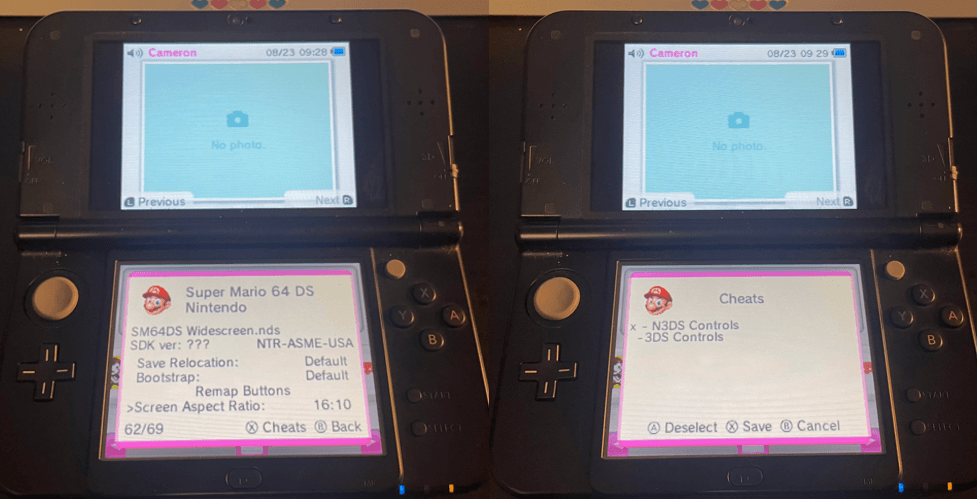

# Super Mario 64 DS - Widescreen + Circle Pad 3DS Install Guide 2026

Finally. How the game was meant to be played.

The following guide enables this game to run on **3DS** consoles with **widescreen**, **circle pad**, and **c-stick** support. It works on all 3DS (and 2DS) consoles, but it will need to be [softmodded](https://3ds.hacks.guide/get-started.html). This is not difficult to do if you read and follow the steps closely.

You will need a copy of [Super Mario 64 DS, USA v1.1](https://datomatic.no-intro.org/index.php?page=show_record&s=28&n=0056).
- MD5: `4ced5213f558e297541cb7314c909401`
- SHA1: `7bf8a92b259e303899851034d85c531ccdc532e2`

I prefer to be verbose and explain the reasons behind everything we do. If you would rather not be bored with details, I'd like to believe important information is clear enough to be skimmable.

Existing guides you might be finding online tend to be **outdated** or **incorrect**. I hope this guide can clear up any confusion and get you into Bob-Omb Battlefield as painlessly as possible.

This guide was made possible thanks to:
- [TWiLightMenu++](https://github.com/DS-Homebrew/TWiLightMenu) and the [DS-Homebrew](https://wiki.ds-homebrew.com/) developers
- [shocoman](https://github.com/shocoman) for the [3DS controls](https://github.com/shocoman/Analog-Controls-for-NDS-Games-on-3DS/tree/master/action_replay_codes)
- Whoever made the widescreen patch, wish I knew
- DeadSkullzJr's [NDS(i) Cheat Database](https://gbatemp.net/threads/deadskullzjrs-nds-i-cheat-databases.488711/)
- LumaTeam's [Luma3DS](https://github.com/LumaTeam/Luma3DS)
- SciresM's [boot9strap](https://github.com/SciresM/boot9strap)
- [3DS Hacks Guide](https://3ds.hacks.guide/) and its [maintainers](https://3ds.hacks.guide/credits.html)

# How To Install

## 1. [Install TWiLightMenu++](https://wiki.ds-homebrew.com/twilightmenu/installing-3ds#installing)

TWiLightMenu++ is how we are going to run original DS games with patches and mods on your 3DS.

### Follow the "[Installing](https://wiki.ds-homebrew.com/twilightmenu/installing-3ds#installing)" section **only**.

Every other section below is irrelevant. Pick any of the four installation methods and complete the install instructions.

## 2. [Widescreen + RTCom Patch](https://wiki.ds-homebrew.com/ds-index/rtcom?tab=twilight-menu#installing)

Now, we need to patch **TWL_FIRM** to support 3DS hardware features like the **circle pad**, as well as the ability to **render in widescreen**.

### Follow the "[Installing](https://wiki.ds-homebrew.com/ds-index/rtcom?tab=twilight-menu#installing)" section **only**.

SM64DS has **unique patches** that are not linked here. We will address that next.

Make sure to do **every step** in the "Installing" section, the second half will ensure that the widescreen patches only apply when you manually enable them per-game - **most games will not function with them enabled**.

### You should finish this step with the following files on your SD card:
- `sd:/_nds/TWiLightMenu/TwlBg/Widescreen.cxi`
- `sd:/luma/sysmodules/TwlBg.cxi`

Personally, I'm not a fan of the alternate scaling modes. They can look crisper in some situations, but they all suffer from situational scaling artifacts - the default scaler, though it is generally a bit blurry, looks the most uniform across all graphics.

## 3. [Apply](https://www.marcrobledo.com/RomPatcher.js/) the [SM64DS widescreen patch](../img/sm64dsws/sm64ws_recoded.xdelta)

Using any **xdelta**-compatible [patcher](https://www.marcrobledo.com/RomPatcher.js/), apply the [SM64DS widescreen patch](../img/sm64dsws/sm64ws_recoded.xdelta) to your **Super Mario 64 DS, USA v1.1** ROM.

I do not know where this patch originated or who made it, I am not the author.

### Save as `SM64DS Widescreen.nds`.
Place on your 3DS SD at `sd:/roms/nds/SM64DS Widescreen.nds`.

## 4. Download the [cheat file](../img/sm64dsws/usrcheat.dat)

Place the [cheat file](../img/sm64dsws/usrcheat.dat) in `sd:/_nds/TWiLightMenu/extras/usrcheat.dat`.

For convenience, I have taken the liberty to combine DeadSkullzJr's [NDS(i) Cheat Database](https://gbatemp.net/threads/deadskullzjrs-nds-i-cheat-databases.488711/), version 2026-07-23, with the [SM64DS Input Codes](https://github.com/shocoman/Analog-Controls-for-NDS-Games-on-3DS/tree/master/action_replay_codes). 

Alternatively, the individual action replay code files, as well as a usable [usrcheat.dat](https://github.com/shocoman/Analog-Controls-for-NDS-Games-on-3DS/raw/refs/heads/master/action_replay_codes/usrcheat.dat) file for exclusively those codes, are available in [shocoman's GitHub](https://github.com/shocoman/Analog-Controls-for-NDS-Games-on-3DS/tree/master/action_replay_codes).

## 5. Enable 16:10 and Cheats in TWiLightMenu++

Boot TWiLightMenu++, find the icon for SM64DS, and press `(Y)`.

Scroll to the bottom and set `Screen Aspect Ratio` to `16:10`.

With this menu still open, press `(X)` to access the Cheats menu, and enable the appropriate code for your system.

Press `(X)` to save, and then...

## 6. Boot the game

*It's-a me, Mario!*